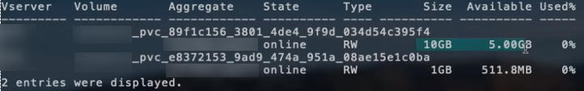

= Opciones y ejemplos de configuración NAS de ONTAP
:hardbreaks:
:allow-uri-read: 
:icons: font
:imagesdir: ../media/

[role="lead"]
Descubre cómo crear y utilizar controladores NAS de ONTAP con tu instalación de Astra Trident. Esta sección proporciona ejemplos de configuración de backend y detalles para la asignación de back-ends a StorageClasses.

== Opciones de configuración del back-end

Consulte la siguiente tabla para ver las opciones de configuración del back-end:

[cols="1,3,2"]
|===
| Parámetro | Descripción | Predeterminado 

| `version` |  | Siempre 1 

| `storageDriverName` | Nombre del controlador de almacenamiento | «ontap-nas», «ontap-nas-economy», «ontap-nas-flexgroup», «ontap-san», «ontap-san-economy» 

| `backendName` | Nombre personalizado o el back-end de almacenamiento | Nombre de controlador + «_» + LIF de datos 

| `managementLIF` | La dirección IP de una LIF de gestión de clústeres o SVM

Se puede especificar un nombre de dominio completo (FQDN).

Se puede configurar para que utilice direcciones IPv6 si se instaló Astra Trident mediante el `--use-ipv6` bandera. Las direcciones IPv6 deben definirse entre corchetes, como `[28e8:d9fb:a825:b7bf:69a8:d02f:9e7b:3555]`.

Para un cambio de MetroCluster fluido, consulte <<mcc-best>>. | “10.0.0.1”, “[2001:1234:abcd::fefe]” 

| `dataLIF` | Dirección IP de LIF de protocolo.

Recomendamos especificar `dataLIF`. En caso de no proporcionar esta información, Astra Trident busca las LIF de datos desde la SVM. Puede especificar un nombre de dominio completo (FQDN) para las operaciones de montaje de NFS, lo que permite crear un DNS round-robin para lograr el equilibrio de carga entre varios LIF de datos.

Se puede cambiar después del ajuste inicial. Consulte .

Se puede configurar para que utilice direcciones IPv6 si se instaló Astra Trident mediante el `--use-ipv6` bandera. Las direcciones IPv6 deben definirse entre corchetes, como `[28e8:d9fb:a825:b7bf:69a8:d02f:9e7b:3555]`.

*Omitir para MetroCluster.* Ver <<mcc-best>>. | Dirección especificada o derivada de la SVM, si no se especifica (no recomendada) 

| `svm` | Máquina virtual de almacenamiento que usar

*Omitir para MetroCluster.* Ver <<mcc-best>>. | Derivado si una SVM `managementLIF` está especificado 

| `autoExportPolicy` | Habilite la creación y actualización automática de la política de exportación [Boolean]. Con el `autoExportPolicy` y.. `autoExportCIDRs` Astra Trident puede gestionar automáticamente las políticas de exportación. | falso 

| `autoExportCIDRs` | Lista de CIDRs para filtrar las IP del nodo de Kubernetes contra cuando `autoExportPolicy` está habilitado.

Con el `autoExportPolicy` y.. `autoExportCIDRs` Astra Trident puede gestionar automáticamente las políticas de exportación. | [«0,0.0,0/0», «:/0»] 

| `labels` | Conjunto de etiquetas con formato JSON arbitrario que se aplica en los volúmenes | "" 

| `clientCertificate` | Valor codificado en base64 del certificado de cliente. Se utiliza para autenticación basada en certificados | "" 

| `clientPrivateKey` | Valor codificado en base64 de la clave privada de cliente. Se utiliza para autenticación basada en certificados | "" 

| `trustedCACertificate` | Valor codificado en base64 del certificado de CA de confianza. Opcional. Se utiliza para autenticación basada en certificados | "" 

| `username` | Nombre de usuario para conectarse al clúster/SVM. Se utiliza para autenticación basada en credenciales |  

| `password` | Contraseña para conectarse al clúster/SVM. Se utiliza para autenticación basada en credenciales |  

| `storagePrefix` | El prefijo que se utiliza cuando se aprovisionan volúmenes nuevos en la SVM. No se puede actualizar después de configurarlo | «trident» 

| `limitAggregateUsage` | Error al aprovisionar si el uso supera este porcentaje. *No se aplica a Amazon FSX para ONTAP* | "" (no se aplica de forma predeterminada) 

| `limitVolumeSize` | Error en el aprovisionamiento si el tamaño del volumen solicitado es superior a este valor. | '' (no se aplica por defecto) 

| `limitVolumeSize` | Error en el aprovisionamiento si el tamaño del volumen solicitado es superior a este valor. También restringe el tamaño máximo de los volúmenes que gestiona para qtrees y LUN, y la `qtreesPerFlexvol` Permite personalizar el número máximo de qtrees por FlexVol. | '' (no se aplica por defecto) 

| `lunsPerFlexvol` | El número máximo de LUN por FlexVol debe estar comprendido entre [50 y 200] | «100» 

| `debugTraceFlags` | Indicadores de depuración que se deben usar para la solución de problemas. Ejemplo, {«api»:false, «method»:true}

No utilizar `debugTraceFlags` a menos que esté solucionando problemas y necesite un volcado de registro detallado. | nulo 

| `nasType` | Configure la creación de volúmenes NFS o SMB. Las opciones son `nfs`, `smb` o nulo. El valor predeterminado es nulo en volúmenes de NFS. | `nfs` 

| `nfsMountOptions` | Lista de opciones de montaje NFS separadas por comas. Las opciones de montaje para los volúmenes persistentes de Kubernetes se especifican normalmente en tipos de almacenamiento, pero si no se especifican opciones de montaje en una clase de almacenamiento, Astra Trident se pondrá en contacto con las opciones de montaje especificadas en el archivo de configuración del back-end de almacenamiento. Si no se especifican opciones de montaje en la clase de almacenamiento o el archivo de configuración, Astra Trident no configurará ninguna opción de montaje en un volumen persistente asociado. | "" 

| `qtreesPerFlexvol` | El número máximo de qtrees por FlexVol debe estar comprendido entre [50, 300] | «200» 

| `smbShare` | Puede especificar una de las siguientes opciones: El nombre de un recurso compartido de SMB creado mediante la consola de administración de Microsoft o la interfaz de línea de comandos de ONTAP; un nombre para permitir que Astra Trident cree el recurso compartido de SMB; o bien puede dejar el parámetro en blanco para evitar el acceso de recurso compartido común a los volúmenes.

Este parámetro es opcional para ONTAP en las instalaciones.

Este parámetro es necesario para los back-ends de Amazon FSx para ONTAP y no puede estar en blanco. | `smb-share` 

| `useREST` | Parámetro booleano para usar las API DE REST de ONTAP. *Vista previa técnica*
`useREST` se proporciona como **avance técnico** que se recomienda para entornos de prueba y no para cargas de trabajo de producción. Cuando se establece en `true`, Astra Trident utilizará las API DE REST de ONTAP para comunicarse con el back-end. Esta función requiere ONTAP 9.11.1 o posterior. Además, el rol de inicio de sesión de ONTAP utilizado debe tener acceso a `ontap` cliente más. Esto está satisfecho por el predefinido `vsadmin` y.. `cluster-admin` funciones.
`useREST` No es compatible con MetroCluster. | falso 
|===

== Opciones de configuración de back-end para el aprovisionamiento de volúmenes

Puede controlar el aprovisionamiento predeterminado utilizando estas opciones en la `defaults` sección de la configuración. Para ver un ejemplo, vea los ejemplos de configuración siguientes.

[cols="1,3,2"]
|===
| Parámetro | Descripción | Predeterminado 

| `spaceAllocation` | Asignación de espacio para las LUN | verdadero 

| `spaceReserve` | Modo de reserva de espacio; «ninguno» (fino) o «volumen» (grueso) | ninguno 

| `snapshotPolicy` | Política de Snapshot que se debe usar | ninguno 

| `qosPolicy` | Grupo de políticas de calidad de servicio que se asignará a los volúmenes creados. Elija uno de qosPolicy o adaptiveQosPolicy por pool/back-end de almacenamiento | "" 

| `adaptiveQosPolicy` | Grupo de políticas de calidad de servicio adaptativo que permite asignar los volúmenes creados. Elija uno de qosPolicy o adaptiveQosPolicy por pool/back-end de almacenamiento. no admitido por ontap-nas-Economy. | "" 

| `snapshotReserve` | Porcentaje de volumen reservado para las Snapshot | «0» si `snapshotPolicy` no es “ninguno”, de lo contrario” 

| `splitOnClone` | Divida un clon de su elemento principal al crearlo | "falso" 

| `encryption` | Habilite el cifrado de volúmenes de NetApp (NVE) en el volumen nuevo; el valor predeterminado es `false`. Para usar esta opción, debe tener una licencia para NVE y habilitarse en el clúster. Si NAE está habilitado en el back-end, cualquier volumen aprovisionado en Astra Trident estará habilitado para NAE. Para obtener más información, consulte: link:../trident-reco/security-reco.html["Cómo funciona Astra Trident con NVE y NAE"]. | "falso" 

| `tieringPolicy` | Política de organización en niveles para utilizar ninguna | «Solo Snapshot» para la configuración SVM-DR anterior a ONTAP 9,5 

| `unixPermissions` | Modo para volúmenes nuevos | «777» para volúmenes NFS; vacío (no aplicable) para volúmenes SMB 

| `snapshotDir` | Controla el acceso al `.snapshot` directorio | "falso" 

| `exportPolicy` | Política de exportación que se va a utilizar | "predeterminado" 

| `securityStyle` | Estilo de seguridad para nuevos volúmenes. Compatibilidad con NFS `mixed` y.. `unix` estilos de seguridad. SMB admite `mixed` y.. `ntfs` estilos de seguridad. | El valor predeterminado de NFS es `unix`. La opción predeterminada de SMB es `ntfs`. 
|===

NOTE: El uso de grupos de políticas de calidad de servicio con Astra Trident requiere ONTAP 9.8 o posterior. Se recomienda utilizar un grupo de políticas de calidad de servicio no compartido y asegurarse de que el grupo de políticas se aplique a cada componente individualmente. Un grupo de políticas de calidad de servicio compartido hará que se aplique el techo para el rendimiento total de todas las cargas de trabajo.

=== Ejemplos de aprovisionamiento de volúmenes

Aquí hay un ejemplo con los valores predeterminados definidos:

[listing]
----
---
version: 1
storageDriverName: ontap-nas
backendName: customBackendName
managementLIF: 10.0.0.1
dataLIF: 10.0.0.2
labels:
  k8scluster: dev1
  backend: dev1-nasbackend
svm: trident_svm
username: cluster-admin
password: <password>
limitAggregateUsage: 80%
limitVolumeSize: 50Gi
nfsMountOptions: nfsvers=4
debugTraceFlags:
  api: false
  method: true
defaults:
  spaceReserve: volume
  qosPolicy: premium
  exportPolicy: myk8scluster
  snapshotPolicy: default
  snapshotReserve: '10'

----
Para `ontap-nas` y.. `ontap-nas-flexgroups`, Astra Trident utiliza ahora un nuevo cálculo para garantizar que el tamaño de la FlexVol sea correcto con el porcentaje snapshotReserve y la RVP. Cuando el usuario solicita una RVP, Astra Trident crea el FlexVol original con más espacio mediante el nuevo cálculo. Este cálculo garantiza que el usuario recibe el espacio de escritura que solicitó en el PVC y no menos espacio que el que solicitó. Antes de v21.07, cuando el usuario solicita una RVP (por ejemplo, 5GIB) con el 50 por ciento de snapshotReserve, solo obtiene 2,5 GIB de espacio editable. Esto se debe a que el usuario solicitó es todo el volumen y. `snapshotReserve` es un porcentaje de esta situación. Con Trident 21.07, lo que el usuario solicita es el espacio editable y Astra Trident define el `snapshotReserve` número como porcentaje del volumen completo. Esto no se aplica a. `ontap-nas-economy`. Vea el siguiente ejemplo para ver cómo funciona:

El cálculo es el siguiente:

[listing]
----
Total volume size = (PVC requested size) / (1 - (snapshotReserve percentage) / 100)
----
Para snapshotReserve = 50 % y la solicitud de RVP = 5 GIB, el tamaño total del volumen es 2/.5 = 10 GIB y el tamaño disponible es de 5 GIB, lo que es lo que solicitó el usuario en la solicitud de RVP. La `volume show` el comando debería mostrar resultados similares a los de este ejemplo:

Los back-ends existentes de instalaciones anteriores aprovisionan volúmenes como se explicó anteriormente al actualizar Astra Trident. En el caso de los volúmenes que creó antes de actualizar, debe cambiar el tamaño de sus volúmenes para que se observe el cambio. Por ejemplo, una RVP de 2 GIB con `snapshotReserve=50` Anteriormente, se produjo un volumen que proporciona 1 GIB de espacio editable. Cambiar el tamaño del volumen a 3 GIB, por ejemplo, proporciona a la aplicación 3 GIB de espacio editable en un volumen de 6 GIB.

== Ejemplos de configuración mínima

Los ejemplos siguientes muestran configuraciones básicas que dejan la mayoría de los parámetros en los valores predeterminados. Esta es la forma más sencilla de definir un back-end.

NOTE: Si utiliza Amazon FSX en ONTAP de NetApp con Trident, la recomendación es especificar nombres DNS para las LIF en lugar de direcciones IP.

.Ejemplo de economía NAS de ONTAP
[%collapsible]
====
[listing]
----
---
version: 1
storageDriverName: ontap-nas-economy
managementLIF: 10.0.0.1
dataLIF: 10.0.0.2
svm: svm_nfs
username: vsadmin
password: password
----
====
.Ejemplo de FlexGroup NAS de ONTAP
[%collapsible]
====
[listing]
----
---
version: 1
storageDriverName: ontap-nas-flexgroup
managementLIF: 10.0.0.1
dataLIF: 10.0.0.2
svm: svm_nfs
username: vsadmin
password: password
----
====
.Ejemplo de MetroCluster
[#mcc-best%collapsible]
====
Puede configurar el backend para evitar tener que actualizar manualmente la definición de backend después del switchover y el switchover durante link:../trident-reco/backup.html#svm-replication-and-recovery["Replicación y recuperación de SVM"].

Para obtener una conmutación de sitios y una conmutación de estado sin problemas, especifique la SVM con `managementLIF` y omita la `dataLIF` y.. `svm` parámetros. Por ejemplo:

[listing]
----
---
version: 1
storageDriverName: ontap-nas
managementLIF: 192.168.1.66
username: vsadmin
password: password
----
====
.Ejemplo de volúmenes de SMB
[%collapsible]
====
[listing]
----

---
version: 1
backendName: ExampleBackend
storageDriverName: ontap-nas
managementLIF: 10.0.0.1
nasType: smb
securityStyle: ntfs
unixPermissions: ""
dataLIF: 10.0.0.2
svm: svm_nfs
username: vsadmin
password: password
----
====
.Ejemplo de autenticación basada en certificados
[%collapsible]
====
Este es un ejemplo de configuración de backend mínima. `clientCertificate`, `clientPrivateKey`, y. `trustedCACertificate` (Opcional, si se utiliza una CA de confianza) se completan en `backend.json` Y tome los valores codificados base64 del certificado de cliente, la clave privada y el certificado de CA de confianza, respectivamente.

[listing]
----
---
version: 1
backendName: DefaultNASBackend
storageDriverName: ontap-nas
managementLIF: 10.0.0.1
dataLIF: 10.0.0.15
svm: nfs_svm
clientCertificate: ZXR0ZXJwYXB...ICMgJ3BhcGVyc2
clientPrivateKey: vciwKIyAgZG...0cnksIGRlc2NyaX
trustedCACertificate: zcyBbaG...b3Igb3duIGNsYXNz
storagePrefix: myPrefix_
----
====
.Ejemplo de política de exportación automática
[%collapsible]
====
En este ejemplo se muestra cómo puede indicar a Astra Trident que utilice políticas de exportación dinámicas para crear y gestionar automáticamente la directiva de exportación. Esto funciona igual para el `ontap-nas-economy` y.. `ontap-nas-flexgroup` de windows

[listing]
----
---
version: 1
storageDriverName: ontap-nas
managementLIF: 10.0.0.1
dataLIF: 10.0.0.2
svm: svm_nfs
labels:
  k8scluster: test-cluster-east-1a
  backend: test1-nasbackend
autoExportPolicy: true
autoExportCIDRs:
- 10.0.0.0/24
username: admin
password: password
nfsMountOptions: nfsvers=4
----
====
.Ejemplo de direcciones IPv6
[%collapsible]
====
Este ejemplo muestra `managementLIF` Uso de una dirección IPv6.

[listing]
----
---
version: 1
storageDriverName: ontap-nas
backendName: nas_ipv6_backend
managementLIF: "[5c5d:5edf:8f:7657:bef8:109b:1b41:d491]"
labels:
  k8scluster: test-cluster-east-1a
  backend: test1-ontap-ipv6
svm: nas_ipv6_svm
username: vsadmin
password: password
----
====
.Ejemplo de Amazon FSx para ONTAP mediante volúmenes de bloque de mensajes del servidor
[%collapsible]
====
La `smbShare` El parámetro es obligatorio para FSx para ONTAP mediante volúmenes de bloque de mensajes del servidor.

[listing]
----
---
version: 1
backendName: SMBBackend
storageDriverName: ontap-nas
managementLIF: example.mgmt.fqdn.aws.com
nasType: smb
dataLIF: 10.0.0.15
svm: nfs_svm
smbShare: smb-share
clientCertificate: ZXR0ZXJwYXB...ICMgJ3BhcGVyc2
clientPrivateKey: vciwKIyAgZG...0cnksIGRlc2NyaX
trustedCACertificate: zcyBbaG...b3Igb3duIGNsYXNz
storagePrefix: myPrefix_
----
====

== Ejemplos de back-ends con pools virtuales

En los archivos de definición de backend de ejemplo que se muestran a continuación, se establecen valores predeterminados específicos para todos los pools de almacenamiento, como `spaceReserve` en ninguno, `spaceAllocation` en falso, y. `encryption` en falso. Los pools virtuales se definen en la sección de almacenamiento.

Astra Trident establece etiquetas de aprovisionamiento en el campo «Comentarios». Los comentarios se establecen en FlexVol para `ontap-nas` O FlexGroup para `ontap-nas-flexgroup`. Astra Trident copia todas las etiquetas presentes en un pool virtual al volumen de almacenamiento al aprovisionar. Para mayor comodidad, los administradores de almacenamiento pueden definir etiquetas por pool virtual y agrupar volúmenes por etiqueta.

En estos ejemplos, algunos de los pools de almacenamiento establecen sus propios `spaceReserve`, `spaceAllocation`, y. `encryption` y algunos pools sustituyen los valores predeterminados.

.Ejemplo de NAS de ONTAP
[%collapsible%open]
====
[listing]
----
---
version: 1
storageDriverName: ontap-nas
managementLIF: 10.0.0.1
svm: svm_nfs
username: admin
password: <password>
nfsMountOptions: nfsvers=4
defaults:
  spaceReserve: none
  encryption: 'false'
  qosPolicy: standard
labels:
  store: nas_store
  k8scluster: prod-cluster-1
region: us_east_1
storage:
- labels:
    app: msoffice
    cost: '100'
  zone: us_east_1a
  defaults:
    spaceReserve: volume
    encryption: 'true'
    unixPermissions: '0755'
    adaptiveQosPolicy: adaptive-premium
- labels:
    app: slack
    cost: '75'
  zone: us_east_1b
  defaults:
    spaceReserve: none
    encryption: 'true'
    unixPermissions: '0755'
- labels:
    department: legal
    creditpoints: '5000'
  zone: us_east_1b
  defaults:
    spaceReserve: none
    encryption: 'true'
    unixPermissions: '0755'
- labels:
    app: wordpress
    cost: '50'
  zone: us_east_1c
  defaults:
    spaceReserve: none
    encryption: 'true'
    unixPermissions: '0775'
- labels:
    app: mysqldb
    cost: '25'
  zone: us_east_1d
  defaults:
    spaceReserve: volume
    encryption: 'false'
    unixPermissions: '0775'
----
====
.Ejemplo de FlexGroup NAS de ONTAP
[%collapsible%open]
====
[listing]
----
---
version: 1
storageDriverName: ontap-nas-flexgroup
managementLIF: 10.0.0.1
svm: svm_nfs
username: vsadmin
password: <password>
defaults:
  spaceReserve: none
  encryption: 'false'
labels:
  store: flexgroup_store
  k8scluster: prod-cluster-1
region: us_east_1
storage:
- labels:
    protection: gold
    creditpoints: '50000'
  zone: us_east_1a
  defaults:
    spaceReserve: volume
    encryption: 'true'
    unixPermissions: '0755'
- labels:
    protection: gold
    creditpoints: '30000'
  zone: us_east_1b
  defaults:
    spaceReserve: none
    encryption: 'true'
    unixPermissions: '0755'
- labels:
    protection: silver
    creditpoints: '20000'
  zone: us_east_1c
  defaults:
    spaceReserve: none
    encryption: 'true'
    unixPermissions: '0775'
- labels:
    protection: bronze
    creditpoints: '10000'
  zone: us_east_1d
  defaults:
    spaceReserve: volume
    encryption: 'false'
    unixPermissions: '0775'
----
====
.Ejemplo de economía NAS de ONTAP
[%collapsible%open]
====
[listing]
----
---
version: 1
storageDriverName: ontap-nas-economy
managementLIF: 10.0.0.1
svm: svm_nfs
username: vsadmin
password: <password>
defaults:
  spaceReserve: none
  encryption: 'false'
labels:
  store: nas_economy_store
region: us_east_1
storage:
- labels:
    department: finance
    creditpoints: '6000'
  zone: us_east_1a
  defaults:
    spaceReserve: volume
    encryption: 'true'
    unixPermissions: '0755'
- labels:
    protection: bronze
    creditpoints: '5000'
  zone: us_east_1b
  defaults:
    spaceReserve: none
    encryption: 'true'
    unixPermissions: '0755'
- labels:
    department: engineering
    creditpoints: '3000'
  zone: us_east_1c
  defaults:
    spaceReserve: none
    encryption: 'true'
    unixPermissions: '0775'
- labels:
    department: humanresource
    creditpoints: '2000'
  zone: us_east_1d
  defaults:
    spaceReserve: volume
    encryption: 'false'
    unixPermissions: '0775'
----
====

== Asigne los back-ends a StorageClass

Las siguientes definiciones de StorageClass se refieren a <<Ejemplos de back-ends con pools virtuales>>. Con el `parameters.selector` Cada StorageClass llama la atención sobre qué pools virtuales pueden usarse para alojar un volumen. El volumen tendrá los aspectos definidos en el pool virtual elegido.

* La `protection-gold` StorageClass se asignará al primer y segundo pool virtual del `ontap-nas-flexgroup` back-end. Estos son los únicos pools que ofrecen protección de nivel Gold.
+
[listing]
----
apiVersion: storage.k8s.io/v1
kind: StorageClass
metadata:
  name: protection-gold
provisioner: netapp.io/trident
parameters:
  selector: "protection=gold"
  fsType: "ext4"
----
* La `protection-not-gold` StorageClass se asignará al tercer y cuarto pool virtual del `ontap-nas-flexgroup` back-end. Estos son los únicos pools que ofrecen un nivel de protección distinto al Gold.
+
[listing]
----
apiVersion: storage.k8s.io/v1
kind: StorageClass
metadata:
  name: protection-not-gold
provisioner: netapp.io/trident
parameters:
  selector: "protection!=gold"
  fsType: "ext4"
----
* La `app-mysqldb` StorageClass se asignará al cuarto pool virtual del `ontap-nas` back-end. Este es el único pool que ofrece configuración de pool de almacenamiento para la aplicación de tipo mysqldb.
+
[listing]
----
apiVersion: storage.k8s.io/v1
kind: StorageClass
metadata:
  name: app-mysqldb
provisioner: netapp.io/trident
parameters:
  selector: "app=mysqldb"
  fsType: "ext4"
----
* T. `protection-silver-creditpoints-20k` StorageClass se asignará al tercer pool virtual del `ontap-nas-flexgroup` back-end. Este es el único pool que ofrece protección de nivel plata y 20000 puntos de crédito.
+
[listing]
----
apiVersion: storage.k8s.io/v1
kind: StorageClass
metadata:
  name: protection-silver-creditpoints-20k
provisioner: netapp.io/trident
parameters:
  selector: "protection=silver; creditpoints=20000"
  fsType: "ext4"
----
* La `creditpoints-5k` StorageClass se asignará al tercer pool virtual del `ontap-nas` backend y segundo pool virtual en `ontap-nas-economy` back-end. Estas son las únicas ofertas de grupo con 5000 puntos de crédito.
+
[listing]
----
apiVersion: storage.k8s.io/v1
kind: StorageClass
metadata:
  name: creditpoints-5k
provisioner: netapp.io/trident
parameters:
  selector: "creditpoints=5000"
  fsType: "ext4"
----

Astra Trident decidirá qué pool virtual se selecciona y garantizará que se cumplan los requisitos de almacenamiento.

== Actualizar `dataLIF` tras la configuración inicial

Puede cambiar la LIF de datos tras la configuración inicial ejecutando el siguiente comando para proporcionar el nuevo archivo JSON back-end con LIF de datos actualizadas.

[listing]
----
tridentctl update backend <backend-name> -f <path-to-backend-json-file-with-updated-dataLIF>
----

NOTE: Si los RVP están conectados a uno o varios pods, deben recuperar todos los pods correspondientes y, a continuación, traerlos para que surta efecto el nuevo LIF de datos.
