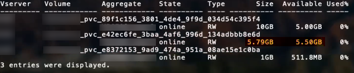

= Opciones y ejemplos de configuración DE SAN ONTAP
:hardbreaks:
:allow-uri-read: 
:icons: font
:imagesdir: ../media/

[role="lead"]
Descubre cómo crear y utilizar controladores SAN de ONTAP con tu instalación de Astra Trident. Esta sección proporciona ejemplos de configuración de backend y detalles para la asignación de back-ends a StorageClasses.

== Opciones de configuración del back-end

Consulte la siguiente tabla para ver las opciones de configuración del back-end:

[cols="1,3,2"]
|===
| Parámetro | Descripción | Predeterminado 

| `version` |  | Siempre 1 

| `storageDriverName` | Nombre del controlador de almacenamiento | `ontap-nas`, `ontap-nas-economy`, `ontap-nas-flexgroup`, `ontap-san`, `ontap-san-economy` 

| `backendName` | Nombre personalizado o el back-end de almacenamiento | Nombre de controlador + «_» + LIF de datos 

| `managementLIF` | La dirección IP de un clúster o una LIF de gestión de SVM.

Se puede especificar un nombre de dominio completo (FQDN).

Se puede configurar para que utilice direcciones IPv6 si se instaló Astra Trident mediante el `--use-ipv6` bandera. Las direcciones IPv6 deben definirse entre corchetes, como `[28e8:d9fb:a825:b7bf:69a8:d02f:9e7b:3555]`.

Para un cambio de MetroCluster fluido, consulte <<mcc-best>>. | “10.0.0.1”, “[2001:1234:abcd::fefe]” 

| `dataLIF` | Dirección IP de LIF de protocolo.

*No especifique para iSCSI.* Astra Trident utiliza link:https://docs.netapp.com/us-en/ontap/san-admin/selective-lun-map-concept.html["Asignación de LUN selectiva de ONTAP"^] Para descubrir los LIF iSCSI necesarios para establecer una sesión de ruta múltiple. Se genera una advertencia if `dataLIF` se define explícitamente.

*Omitir para MetroCluster.* Ver <<mcc-best>>. | Derivado del SVM 

| `svm` | Máquina virtual de almacenamiento que usar

*Omitir para MetroCluster.* Ver <<mcc-best>>. | Derivado si una SVM `managementLIF` está especificado 

| `useCHAP` | Use CHAP para autenticar iSCSI para los controladores SAN de ONTAP [Boolean]. Establezca en `true` Para Astra Trident, configure y utilice CHAP bidireccional como autenticación predeterminada para la SVM proporcionada en el back-end. Consulte link:ontap-san-prep.html["Prepárese para configurar el back-end con los controladores SAN de ONTAP"] para obtener más detalles. | `false` 

| `chapInitiatorSecret` | Secreto CHAP del iniciador. Obligatorio si `useCHAP=true` | "" 

| `labels` | Conjunto de etiquetas con formato JSON arbitrario que se aplica en los volúmenes | "" 

| `chapTargetInitiatorSecret` | Secreto CHAP del iniciador de destino. Obligatorio si `useCHAP=true` | "" 

| `chapUsername` | Nombre de usuario entrante. Obligatorio si `useCHAP=true` | "" 

| `chapTargetUsername` | Nombre de usuario de destino. Obligatorio si `useCHAP=true` | "" 

| `clientCertificate` | Valor codificado en base64 del certificado de cliente. Se utiliza para autenticación basada en certificados | "" 

| `clientPrivateKey` | Valor codificado en base64 de la clave privada de cliente. Se utiliza para autenticación basada en certificados | "" 

| `trustedCACertificate` | Valor codificado en base64 del certificado de CA de confianza. Opcional. Se utiliza para autenticación basada en certificados. | "" 

| `username` | El nombre de usuario necesario para comunicarse con el clúster de ONTAP. Se utiliza para autenticación basada en credenciales. | "" 

| `password` | La contraseña necesaria para comunicarse con el clúster de ONTAP. Se utiliza para autenticación basada en credenciales. | "" 

| `svm` | Máquina virtual de almacenamiento que usar | Derivado si una SVM `managementLIF` está especificado 

| `storagePrefix` | El prefijo que se utiliza cuando se aprovisionan volúmenes nuevos en la SVM. No se puede modificar más adelante. Para actualizar este parámetro, deberá crear un nuevo backend. | `trident` 

| `limitAggregateUsage` | Error al aprovisionar si el uso supera este porcentaje. Si utiliza un entorno de administración de Amazon FSX para ONTAP de NetApp, no especifique  `limitAggregateUsage`. El proporcionado `fsxadmin` y.. `vsadmin` No incluya los permisos necesarios para recuperar el uso de agregados y limitarlo mediante Astra Trident. | "" (no se aplica de forma predeterminada) 

| `limitVolumeSize` | Error en el aprovisionamiento si el tamaño del volumen solicitado es superior a este valor. También restringe el tamaño máximo de los volúmenes que gestiona para qtrees y LUN. | '' (no se aplica por defecto) 

| `lunsPerFlexvol` | El número máximo de LUN por FlexVol debe estar comprendido entre [50 y 200] | `100` 

| `debugTraceFlags` | Indicadores de depuración que se deben usar para la solución de problemas. Ejemplo, {«api»:false, «method»:true}

No lo utilice a menos que esté solucionando problemas y necesite un volcado de log detallado. | `null` 

| `useREST` | Parámetro booleano para usar las API DE REST de ONTAP. *Vista previa técnica*
`useREST` se proporciona como **avance técnico** que se recomienda para entornos de prueba y no para cargas de trabajo de producción. Cuando se establece en `true`, Astra Trident utilizará las API DE REST de ONTAP para comunicarse con el back-end. Esta función requiere ONTAP 9.11.1 o posterior. Además, el rol de inicio de sesión de ONTAP utilizado debe tener acceso a `ontap` cliente más. Esto está satisfecho por el predefinido `vsadmin` y.. `cluster-admin` funciones.
`useREST` No es compatible con MetroCluster. | `false` 
|===

== Opciones de configuración de back-end para el aprovisionamiento de volúmenes

Puede controlar el aprovisionamiento predeterminado utilizando estas opciones en la `defaults` sección de la configuración. Para ver un ejemplo, vea los ejemplos de configuración siguientes.

[cols="3"]
|===
| Parámetro | Descripción | Predeterminado 

| `spaceAllocation` | Asignación de espacio para las LUN | verdadero 

| `spaceReserve` | Modo de reserva de espacio; «ninguno» (fino) o «volumen» (grueso) | ninguno 

| `snapshotPolicy` | Política de Snapshot que se debe usar | ninguno 

| `qosPolicy` | Grupo de políticas de calidad de servicio que se asignará a los volúmenes creados. Elija uno de qosPolicy o adaptiveQosPolicy por pool/back-end de almacenamiento. El uso de grupos de políticas de calidad de servicio con Astra Trident requiere ONTAP 9.8 o posterior. Recomendamos utilizar un grupo de políticas QoS no compartido y garantizar que el grupo de políticas se aplique a cada componente por separado. Un grupo de políticas de calidad de servicio compartido hará que se aplique el techo para el rendimiento total de todas las cargas de trabajo. | "" 

| `adaptiveQosPolicy` | Grupo de políticas de calidad de servicio adaptativo que permite asignar los volúmenes creados. Elija uno de qosPolicy o adaptiveQosPolicy por pool/back-end de almacenamiento | "" 

| `snapshotReserve` | Porcentaje de volumen reservado para las Snapshot | «0» si `snapshotPolicy` no es “ninguno”, de lo contrario” 

| `splitOnClone` | Divida un clon de su elemento principal al crearlo | "falso" 

| `encryption` | Habilite el cifrado de volúmenes de NetApp (NVE) en el volumen nuevo; el valor predeterminado es `false`. Para usar esta opción, debe tener una licencia para NVE y habilitarse en el clúster. Si NAE está habilitado en el back-end, cualquier volumen aprovisionado en Astra Trident estará habilitado para NAE. Para obtener más información, consulte: link:../trident-reco/security-reco.html["Cómo funciona Astra Trident con NVE y NAE"]. | "falso" 

| `luksEncryption` | Active el cifrado LUKS. Consulte link:../trident-reco/security-luks.html["Usar la configuración de clave unificada de Linux (LUKS)"]. | "" 

| `securityStyle` | Estilo de seguridad para nuevos volúmenes | `unix` 

| `tieringPolicy` | Política de organización en niveles para utilizar ninguna | «Solo Snapshot» para la configuración SVM-DR anterior a ONTAP 9,5 
|===

=== Ejemplos de aprovisionamiento de volúmenes

Aquí hay un ejemplo con los valores predeterminados definidos:

[listing]
----
---
version: 1
storageDriverName: ontap-san
managementLIF: 10.0.0.1
svm: trident_svm
username: admin
password: <password>
labels:
  k8scluster: dev2
  backend: dev2-sanbackend
storagePrefix: alternate-trident
debugTraceFlags:
  api: false
  method: true
defaults:
  spaceReserve: volume
  qosPolicy: standard
  spaceAllocation: 'false'
  snapshotPolicy: default
  snapshotReserve: '10'

----

NOTE: Para todos los volúmenes creados mediante la `ontap-san` Controlador, Astra Trident añade un 10 % adicional de capacidad a FlexVol para acomodar los metadatos de las LUN. La LUN se aprovisionará con el tamaño exacto que el usuario solicite en la RVP. Astra Trident añade el 10 % a FlexVol (se muestra como tamaño disponible en ONTAP). Los usuarios obtienen ahora la cantidad de capacidad utilizable que soliciten. Este cambio también impide que las LUN se conviertan en de solo lectura a menos que se utilice completamente el espacio disponible. Esto no se aplica a ontap-san-economy.

Para los back-ends que definen `snapshotReserve`, Astra Trident calcula el tamaño de los volúmenes de la siguiente manera:

[listing]
----
Total volume size = [(PVC requested size) / (1 - (snapshotReserve percentage) / 100)] * 1.1
----
El 1.1 es el 10 % adicional que Astra Trident añade a FlexVol para acomodar los metadatos de las LUN. Para `snapshotReserve` = 5 % y la solicitud de PVC = 5GIB, el tamaño total del volumen es de 5.79GIB y el tamaño disponible es de 5.5GIB. La `volume show` el comando debería mostrar resultados similares a los de este ejemplo:

En la actualidad, el cambio de tamaño es la única manera de utilizar el nuevo cálculo para un volumen existente.

== Ejemplos de configuración mínima

Los ejemplos siguientes muestran configuraciones básicas que dejan la mayoría de los parámetros en los valores predeterminados. Esta es la forma más sencilla de definir un back-end.

NOTE: Si utiliza Amazon FSx en NetApp ONTAP con Astra Trident, le recomendamos que especifique nombres de DNS para las LIF en lugar de las direcciones IP.

.Ejemplo de SAN ONTAP
[%collapsible]
====
Se trata de una configuración básica que utiliza el `ontap-san` controlador.

[listing]
----
---
version: 1
storageDriverName: ontap-san
managementLIF: 10.0.0.1
svm: svm_iscsi
labels:
  k8scluster: test-cluster-1
  backend: testcluster1-sanbackend
username: vsadmin
password: <password>
----
====
.Ejemplo de economía de SAN ONTAP
[%collapsible]
====
[listing]
----
---
version: 1
storageDriverName: ontap-san-economy
managementLIF: 10.0.0.1
svm: svm_iscsi_eco
username: vsadmin
password: <password>
----
====
.Ejemplo de MetroCluster
[#mcc-best%collapsible]
====
Puede configurar el backend para evitar tener que actualizar manualmente la definición de backend después del switchover y el switchover durante link:../trident-reco/backup.html#svm-replication-and-recovery["Replicación y recuperación de SVM"].

Para obtener una conmutación de sitios y una conmutación de estado sin problemas, especifique la SVM con `managementLIF` y omita la `dataLIF` y.. `svm` parámetros. Por ejemplo:

[listing]
----
---
version: 1
storageDriverName: ontap-san
managementLIF: 192.168.1.66
username: vsadmin
password: password
----
====
.Ejemplo de autenticación basada en certificados
[%collapsible]
====
En este ejemplo de configuración básica `clientCertificate`, `clientPrivateKey`, y. `trustedCACertificate` (Opcional, si se utiliza una CA de confianza) se completan en `backend.json` Y tome los valores codificados base64 del certificado de cliente, la clave privada y el certificado de CA de confianza, respectivamente.

[listing]
----
---
version: 1
storageDriverName: ontap-san
backendName: DefaultSANBackend
managementLIF: 10.0.0.1
svm: svm_iscsi
useCHAP: true
chapInitiatorSecret: cl9qxIm36DKyawxy
chapTargetInitiatorSecret: rqxigXgkesIpwxyz
chapTargetUsername: iJF4heBRT0TCwxyz
chapUsername: uh2aNCLSd6cNwxyz
clientCertificate: ZXR0ZXJwYXB...ICMgJ3BhcGVyc2
clientPrivateKey: vciwKIyAgZG...0cnksIGRlc2NyaX
trustedCACertificate: zcyBbaG...b3Igb3duIGNsYXNz
----
====
.Ejemplos de CHAP bidireccional
[%collapsible]
====
Estos ejemplos crean un backend con `useCHAP` establezca en `true`.

.Ejemplo de CHAP de SAN de ONTAP
[listing]
----
---
version: 1
storageDriverName: ontap-san
managementLIF: 10.0.0.1
svm: svm_iscsi
labels:
  k8scluster: test-cluster-1
  backend: testcluster1-sanbackend
useCHAP: true
chapInitiatorSecret: cl9qxIm36DKyawxy
chapTargetInitiatorSecret: rqxigXgkesIpwxyz
chapTargetUsername: iJF4heBRT0TCwxyz
chapUsername: uh2aNCLSd6cNwxyz
username: vsadmin
password: <password>
----
.Ejemplo de CHAP de economía de SAN ONTAP
[listing]
----
---
version: 1
storageDriverName: ontap-san-economy
managementLIF: 10.0.0.1
svm: svm_iscsi_eco
useCHAP: true
chapInitiatorSecret: cl9qxIm36DKyawxy
chapTargetInitiatorSecret: rqxigXgkesIpwxyz
chapTargetUsername: iJF4heBRT0TCwxyz
chapUsername: uh2aNCLSd6cNwxyz
username: vsadmin
password: <password>
----
====

== Ejemplos de back-ends con pools virtuales

En estos archivos de definición de backend de ejemplo, se establecen valores predeterminados específicos para todos los pools de almacenamiento, como `spaceReserve` en ninguno, `spaceAllocation` en falso, y. `encryption` en falso. Los pools virtuales se definen en la sección de almacenamiento.

Astra Trident establece etiquetas de aprovisionamiento en el campo «Comentarios». Los comentarios se establecen en la FlexVol. Astra Trident copia todas las etiquetas presentes en un pool virtual al volumen de almacenamiento al aprovisionar. Para mayor comodidad, los administradores de almacenamiento pueden definir etiquetas por pool virtual y agrupar volúmenes por etiqueta.

En estos ejemplos, algunos de los pools de almacenamiento establecen sus propios `spaceReserve`, `spaceAllocation`, y. `encryption` y algunos pools sustituyen los valores predeterminados.

.Ejemplo de SAN ONTAP
[%collapsible]
====
[listing]
----
---
version: 1
storageDriverName: ontap-san
managementLIF: 10.0.0.1
svm: svm_iscsi
useCHAP: true
chapInitiatorSecret: cl9qxIm36DKyawxy
chapTargetInitiatorSecret: rqxigXgkesIpwxyz
chapTargetUsername: iJF4heBRT0TCwxyz
chapUsername: uh2aNCLSd6cNwxyz
username: vsadmin
password: <password>
defaults:
  spaceAllocation: 'false'
  encryption: 'false'
  qosPolicy: standard
labels:
  store: san_store
  kubernetes-cluster: prod-cluster-1
region: us_east_1
storage:
- labels:
    protection: gold
    creditpoints: '40000'
  zone: us_east_1a
  defaults:
    spaceAllocation: 'true'
    encryption: 'true'
    adaptiveQosPolicy: adaptive-extreme
- labels:
    protection: silver
    creditpoints: '20000'
  zone: us_east_1b
  defaults:
    spaceAllocation: 'false'
    encryption: 'true'
    qosPolicy: premium
- labels:
    protection: bronze
    creditpoints: '5000'
  zone: us_east_1c
  defaults:
    spaceAllocation: 'true'
    encryption: 'false'
----
====
.Ejemplo de economía de SAN ONTAP
[%collapsible]
====
[listing]
----
---
version: 1
storageDriverName: ontap-san-economy
managementLIF: 10.0.0.1
svm: svm_iscsi_eco
useCHAP: true
chapInitiatorSecret: cl9qxIm36DKyawxy
chapTargetInitiatorSecret: rqxigXgkesIpwxyz
chapTargetUsername: iJF4heBRT0TCwxyz
chapUsername: uh2aNCLSd6cNwxyz
username: vsadmin
password: <password>
defaults:
  spaceAllocation: 'false'
  encryption: 'false'
labels:
  store: san_economy_store
region: us_east_1
storage:
- labels:
    app: oracledb
    cost: '30'
  zone: us_east_1a
  defaults:
    spaceAllocation: 'true'
    encryption: 'true'
- labels:
    app: postgresdb
    cost: '20'
  zone: us_east_1b
  defaults:
    spaceAllocation: 'false'
    encryption: 'true'
- labels:
    app: mysqldb
    cost: '10'
  zone: us_east_1c
  defaults:
    spaceAllocation: 'true'
    encryption: 'false'
- labels:
    department: legal
    creditpoints: '5000'
  zone: us_east_1c
  defaults:
    spaceAllocation: 'true'
    encryption: 'false'
----
====

== Asigne los back-ends a StorageClass

Las siguientes definiciones de StorageClass hacen referencia a la <<Ejemplos de back-ends con pools virtuales>>. Con el `parameters.selector` Cada StorageClass llama la atención sobre qué pools virtuales pueden usarse para alojar un volumen. El volumen tendrá los aspectos definidos en el pool virtual elegido.

* La `protection-gold` StorageClass se asignará al primer pool virtual del `ontap-san` back-end. Este es el único pool que ofrece protección de nivel Gold.
+
[listing]
----
apiVersion: storage.k8s.io/v1
kind: StorageClass
metadata:
  name: protection-gold
provisioner: netapp.io/trident
parameters:
  selector: "protection=gold"
  fsType: "ext4"
----
* La `protection-not-gold` StorageClass se asignará al segundo y tercer pool virtual en `ontap-san` back-end. Estos son los únicos pools que ofrecen un nivel de protección distinto del oro.
+
[listing]
----
apiVersion: storage.k8s.io/v1
kind: StorageClass
metadata:
  name: protection-not-gold
provisioner: netapp.io/trident
parameters:
  selector: "protection!=gold"
  fsType: "ext4"
----
* La `app-mysqldb` StorageClass se asignará al tercer pool virtual en `ontap-san-economy` back-end. Este es el único pool que ofrece configuración de pool de almacenamiento para la aplicación de tipo mysqldb.
+
[listing]
----
apiVersion: storage.k8s.io/v1
kind: StorageClass
metadata:
  name: app-mysqldb
provisioner: netapp.io/trident
parameters:
  selector: "app=mysqldb"
  fsType: "ext4"
----
* La `protection-silver-creditpoints-20k` StorageClass se asignará al segundo pool virtual de `ontap-san` back-end. Este es el único pool que ofrece protección de nivel plata y 20000 puntos de crédito.
+
[listing]
----
apiVersion: storage.k8s.io/v1
kind: StorageClass
metadata:
  name: protection-silver-creditpoints-20k
provisioner: netapp.io/trident
parameters:
  selector: "protection=silver; creditpoints=20000"
  fsType: "ext4"
----
* La `creditpoints-5k` StorageClass se asignará al tercer pool virtual en `ontap-san` backend y cuarto pool virtual en `ontap-san-economy` back-end. Estas son las únicas ofertas de grupo con 5000 puntos de crédito.
+
[listing]
----
apiVersion: storage.k8s.io/v1
kind: StorageClass
metadata:
  name: creditpoints-5k
provisioner: netapp.io/trident
parameters:
  selector: "creditpoints=5000"
  fsType: "ext4"
----

Astra Trident decidirá qué pool virtual se selecciona y garantizará que se cumplan los requisitos de almacenamiento.
