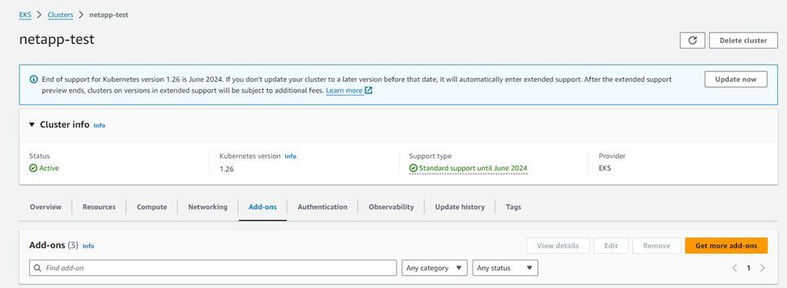
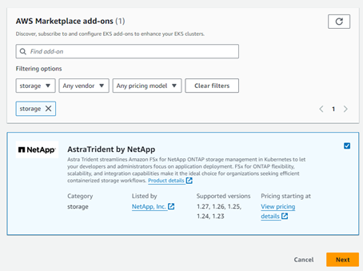
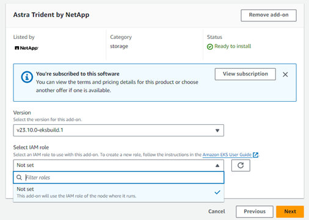
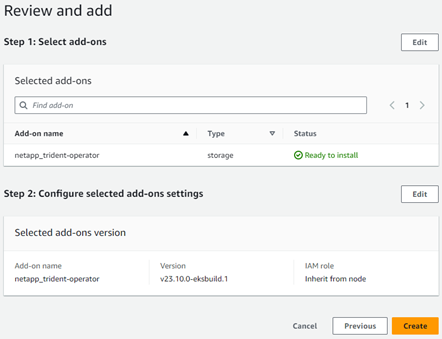
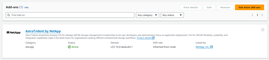

= Configura la versión 23,10 del complemento Astra Trident EKS en el clúster de EKS
:hardbreaks:
:allow-uri-read: 
:icons: font
:imagesdir: ../media/

[role="lead"]
Astra Trident optimiza la gestión del almacenamiento de Amazon FSx para NetApp ONTAP en Kubernetes para que sus desarrolladores y administradores se centren en la puesta en marcha de aplicaciones. El complemento Astra Trident EKS incluye las últimas revisiones de seguridad, correcciones de errores y AWS lo valida para que funcione con Amazon EKS. El complemento EKS le permite garantizar de forma constante que sus clústeres de Amazon EKS sean seguros y estables y reducir la cantidad de trabajo que necesita para instalar, configurar y actualizar complementos.

== Requisitos previos

Asegúrate de disponer de lo siguiente antes de configurar el complemento Astra Trident para AWS EKS:

* Una cuenta de clúster de Amazon EKS con suscripción complementaria
* Permisos de AWS para AWS Marketplace:
`"aws-marketplace:ViewSubscriptions",
"aws-marketplace:Subscribe",
"aws-marketplace:Unsubscribe`
* Tipo de AMI: Amazon Linux 2 (AL2_x86_64) o Amazon Linux 2 Arm (AL2_ARM_64)
* Tipo de nodo: AMD o ARM
* Un sistema de archivos Amazon FSx para NetApp ONTAP existente

== Pasos

. En tu clúster de EKS Kubernetes, navega a la pestaña *Add-ons*.
+

. Vaya a *AWS Marketplace add-ons* y elija la categoría _storage_.
+

. Localiza *AstraTrident by NetApp* y selecciona la casilla de verificación para el complemento Astra Trident.
. Elija la versión deseada del complemento.
+

. Seleccione la opción Rol IAM que desea heredar del nodo.
. Configure cualquier configuración opcional según sea necesario y seleccione *Siguiente*.
+

. Seleccione *Crear*.
. Compruebe que el estado del complemento es _Active_.
+

== Instalar/desinstalar el complemento Astra Trident EKS mediante la CLI

.Instale el complemento Astra Trident EKS mediante la CLI:
Los siguientes comandos de ejemplo instalan el complemento Astra Trident EKS:
`eksctl create addon --cluster K8s-arm --name netapp_trident-operator --version v23.10.0-eksbuild.`
`eksctl create addon --cluster K8s-arm --name netapp_trident-operator --version v23.10.0-eksbuild.1` (con una versión dedicada)

.Desinstale el complemento Astra Trident EKS mediante la CLI:
El siguiente comando desinstala el complemento Astra Trident EKS:
`eksctl delete addon --cluster K8s-arm --name netapp_trident-operator`
